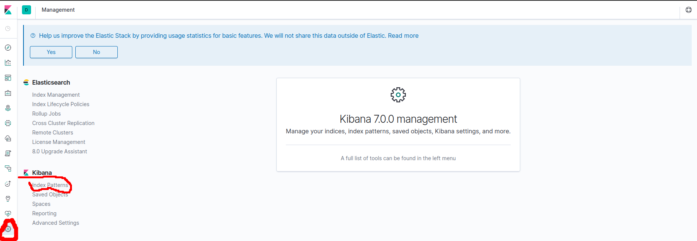
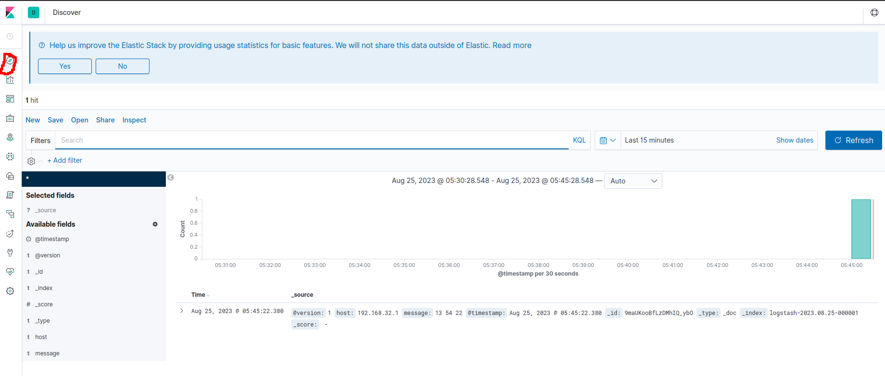
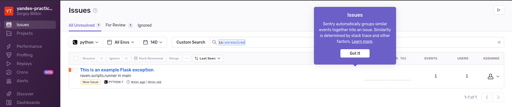

# TEMPLATE FOR ELASTIC-KIBANA-LOGSTASH STACK
### instructions
1. add ```elasticsearch``` to ```docker-compose.yml```
2. add ```kibana``` to ```docker-compose.yml```
3. add ```logstash``` to ```docker-compose.yml```
4. add config for ```logstash```:

* logstash.conf
```
input {
  udp {
    port => "5044"
  }
}
output {

  stdout {
  }
  elasticsearch {
      hosts => [ "${ES_HOST}" ]
  } 
} 
```
5. final ```docker-compose.yml```

```
version: '3.2'

services:

  elasticsearch:
    image: elasticsearch:7.0.0
    environment:
      discovery.type: single-node
    ports:
      - 9200:9200
    volumes:
      - /tmp/esdata:/tmp/elasticsearch/data

  kibana:
    image: kibana:7.0.0
    ports:
      - "5601:5601"
    depends_on:
      - elasticsearch

  logstash:
    image: logstash:7.0.0
    depends_on:
      - elasticsearch
    environment:
      XPACK_MONITORING_ENABLED: "false"
      ES_HOST: "elasticsearch:9200"
    ports:
      - "5044:5044/udp"
    volumes:
      - ./config/logstash.conf:/config/logstash.conf:ro
    command: logstash -f /config/logstash.conf
```

6. run compose ```docker compose up --build```
7. write ```logstash``` to ```elasticsearch```: ```echo -n '13 54 22' | nc -u -q 1 localhost 5044 ```
8. check data in ```kibana``` (Для отображения логов в Kibana требуется завести Index Pattern. Он может полностью совпадать с названием индекса, а может включать в себя несколько индексов с похожими названиями. Например, если ваши логи пишутся в разные индексы в зависимости от даты: logs-2020.12.31, logs-2021.01.01, logs-2021.01.02, то Index Pattern logs* агрегирует записи из всех индексов с префиксом logs, а паттерн logs-2021* будет показывать только результаты за 2021 год.
Чтобы завести паттерн, перейдите в Management → Stack Management → Index Patterns и нажмите Create index pattern.)
    8.1. create ```logstash``` index 
 
    8.2. write data ```echo -n '13 54 22' | nc -u -q 1 localhost 5044``` 
    8.3. check data 
 
9. add ```flask``` app template (flask+nginx)
10. go to https://yandex-practicum-team.sentry.io/issues/
11. create project (flask) https://yandex-practicum-team.sentry.io/projects/python/getting-started/
 

12. add ```filebeat``` to ```docker-compose.yml```

```
filebeat:
      image: docker.elastic.co/beats/filebeat:7.3.2
      volumes:
        - /tmp/logs/nginx:/var/log/nginx:ro
        - ./deploy/filebeat.yml:/usr/share/filebeat/filebeat.yml
      depends_on:
        - app
        - nginx
        - logstash
        - elasticsearch
        - kibana
      links:
        - logstash 
```
